# Music Beat 项目

一个基于数据分析和机器学习的音乐节奏分析项目，通过特征工程和CatBoost模型深入探索音乐特征与流行度的关系。

## 📁 项目结构

```
music_beat/
├── figures/              # 自动保存的高清图表（300 dpi）
│   ├── 01_eda/          # 探索性数据分析图表
│   ├── 02_composite/    # 组合特征分析图表
│   ├── 03_corr/         # 相关性分析图表
│   └── 04_model/        # 模型相关图表
├── src/                 # 源代码（按执行顺序编号）
│   ├── init.py          # 初始化脚本
│   ├── load_clean.py    # 1. 数据读取与类型统一
│   ├── eda.py           # 2. 缺失值/异常值/分布分析
│   ├── composite.py     # 3. 组合特征与单特征分析
│   ├── corr.py          # 4. 相关性矩阵分析
│   ├── model.py         # 5. CatBoost模型与SHAP解释
│   └── run_all.py       # 一键执行入口
├── run.log              # 自动生成的运行日志
└── README.md            # 项目说明文档
```

## 🚀 快速开始

### 环境要求

- Python 3.8+
- 依赖库：pandas, numpy, matplotlib, seaborn, catboost, shap, scikit-learn

### 安装依赖

```bash
pip install -r requirements.txt
```

### 运行项目

一键执行所有分析流程：

```bash
python src/run_all.py
```

或按顺序执行各个模块：

```bash
python src/load_clean.py
python src/eda.py
python src/composite.py
python src/corr.py
python src/model.py
```

## 📊 分析流程

1. **数据加载与清洗** (`load_clean.py`)
   - 读取原始数据
   - 统一数据类型和格式
   - 初步数据质量检查

2. **探索性数据分析** (`eda.py`)
   - 缺失值分析
   - 异常值检测
   - 特征分布可视化

3. **特征工程** (`composite.py`)
   - 创建组合特征
   - 单特征深入分析
   - 特征变换与优化

4. **相关性分析** (`corr.py`)
   - 计算特征相关性矩阵
   - 可视化相关性热力图
   - 识别高度相关特征

5. **建模与解释** (`model.py`)
   - 使用CatBoost构建预测模型
   - 模型性能评估
   - SHAP值分析特征重要性

## 📈 输出结果

- 所有图表自动保存至`figures/`目录下的相应子文件夹
- 图表均以300 dpi高清质量保存
- 运行日志自动记录至`run.log`文件


# Music Beat 项目

## 📊 核心可视化图表
## 🥁 Beats Per Minute 分布

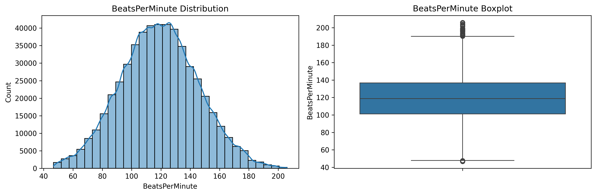

### 1. 基础分析
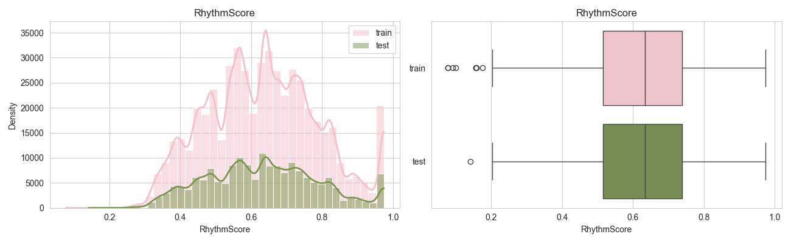
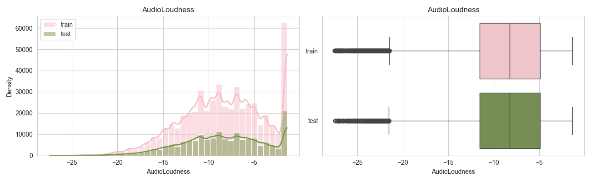
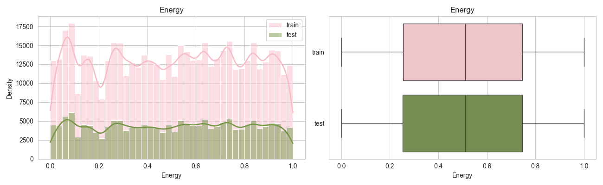

### 2. 组合特征分析
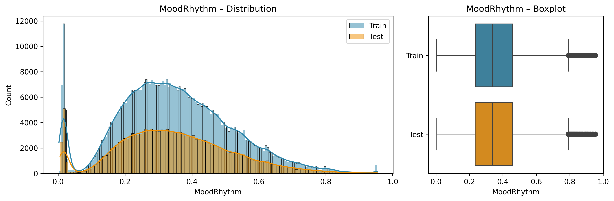
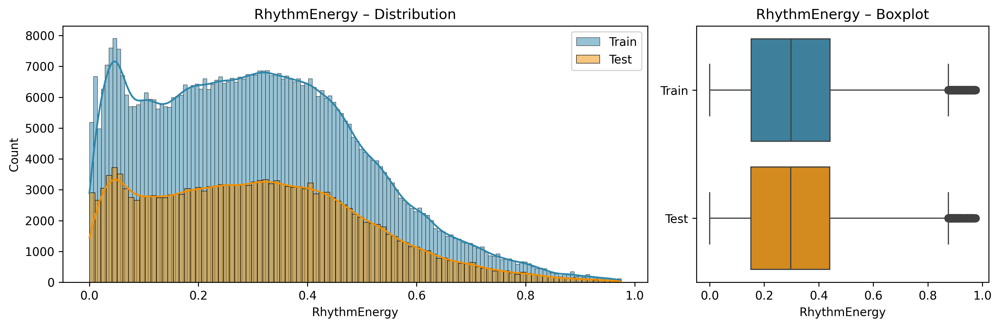
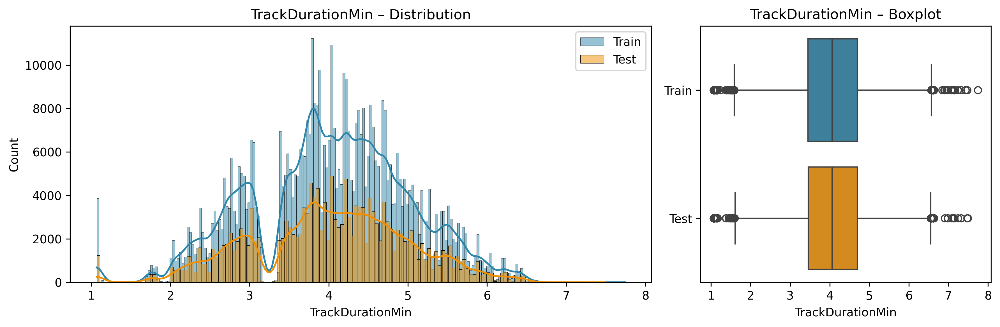

### 3. 相关性分析
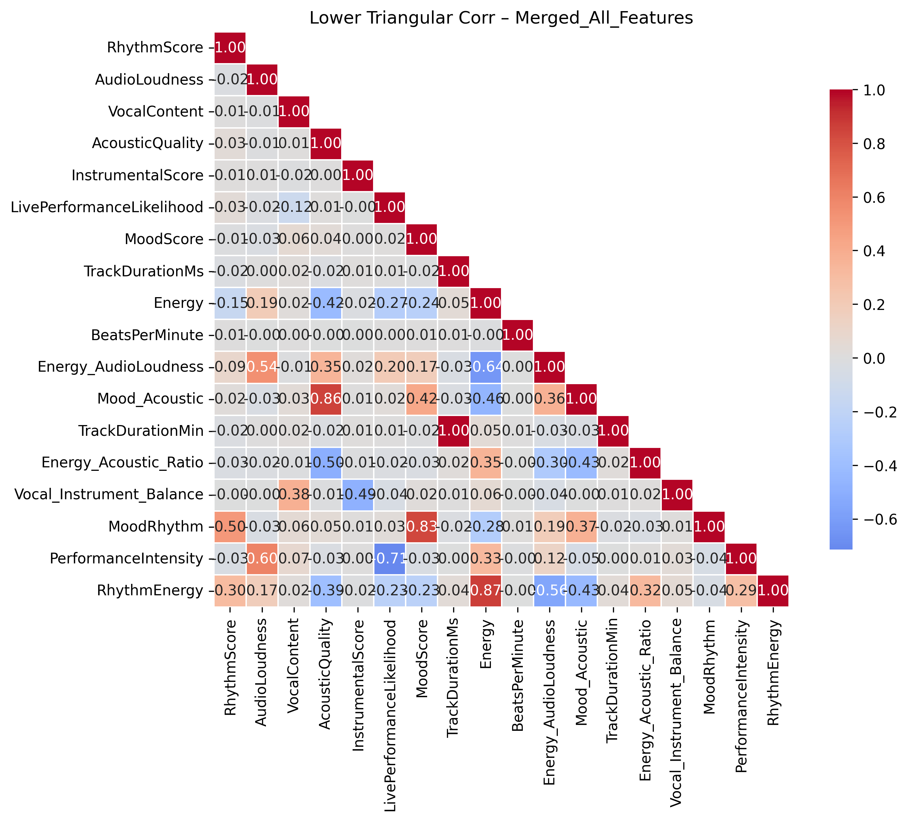
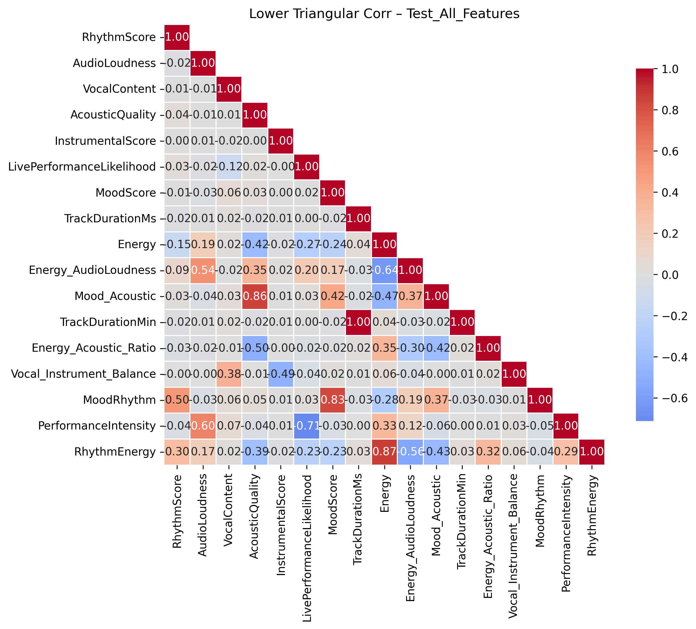
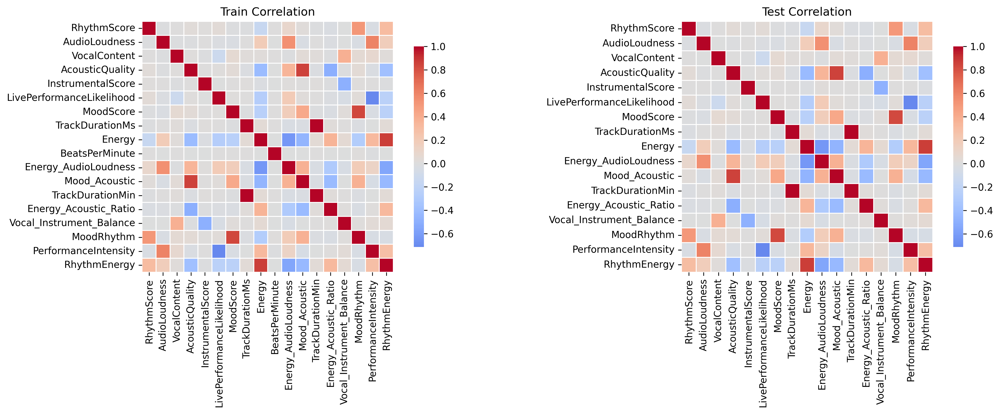

### 4. 模型评估
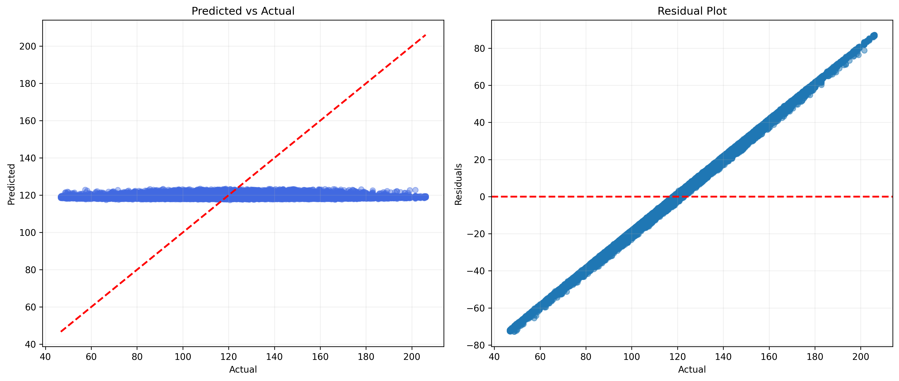


